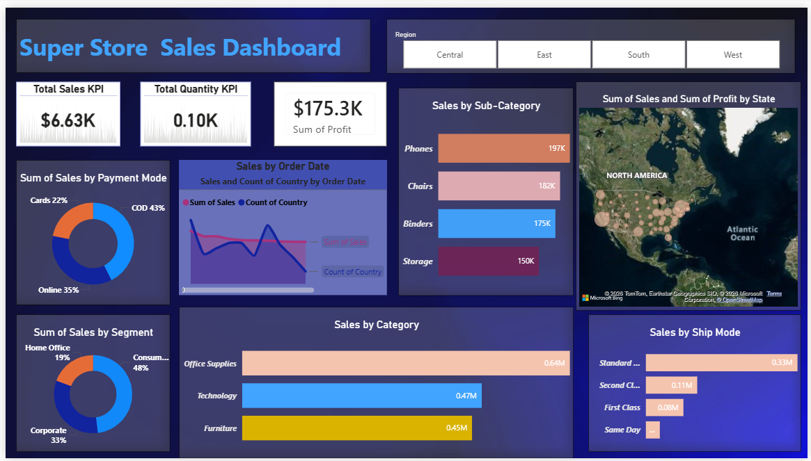

# Super Store Sales Dashboard — Power BI

I built this dashboard to practice turning raw retail transaction 
data into something a business stakeholder could actually use. 
The Superstore dataset is a classic one and I wanted to see what 
meaningful insights I could pull out of it using Power BI.

---

## What I looked at

Sales performance across regions, product categories, customer 
segments, payment modes and shipping types. The goal was to 
answer questions like — which regions are most profitable, 
which categories sell the most, and how are customers paying?

---

## Tools I used

Power BI Desktop, DAX, Excel/CSV

---

## Where the data came from

Superstore Sales Dataset — publicly available on Kaggle.
US retail transactions covering orders, regions, categories,
segments, shipping and payment data.

---

## What I built

An interactive single-page dashboard with:

- KPI cards for total sales, quantity sold and profit
- Sales trend over time (line chart)
- Top sub-categories by sales (bar chart)
- Sales by category — Office Supplies, Technology, Furniture
- Payment mode breakdown — COD, Online, Cards (donut chart)
- Customer segment split — Consumer, Corporate, Home Office
- Shipping mode analysis
- Geographic map of sales and profit by US state
- Region slicer to filter everything — Central, East, South, West

---

## Dashboard Preview

---

## What I found

- Office Supplies is the top selling category, ahead of 
  Technology and Furniture
- COD is the most preferred payment method at 43% which 
  suggests a lot of customers still don't fully trust 
  online payments
- The Consumer segment drives nearly half of all sales — 
  the most important group to retain
- Standard shipping dominates, which makes sense for 
  cost-conscious buyers but leaves room to upsell faster tiers
- Phones and Chairs are the top two sub-categories — 
  worth prioritising in inventory and promotions

---

## How to open it

1. Download Power BI Desktop (free from Microsoft)
2. Download the .pbit file from this repo
3. Open it in Power BI Desktop
4. Dashboard loads with all visuals and slicers ready

---

## Author

Yagnasree Kamireddy  
[GitHub](https://github.com/yagnasreekamireddy)
